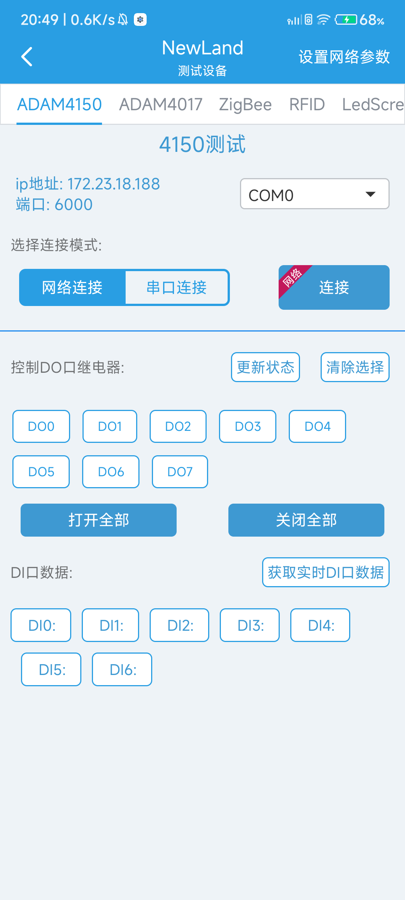
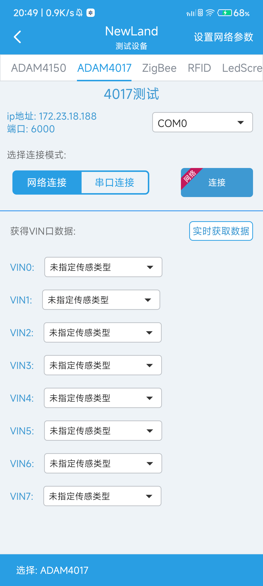

## Newland test

- 本程序用于新大陆设备的连接测试

- ZigBee 是否配置正确及数据传输；
- RFID能否正常读取标签数据；
- LED屏幕发送数据； 
- 使用网络摄像头。
- 注意：默认 IP 地址为 192.168.0.1
- 默认端口号为 6000

## 使用说明

1. 将设备连接到需要测试设备的内网环境

2. 点击获取本地网络信息，确认连接的网络没有问题

3. 进入设置页面，填写设备TCP连接配置信息（IP和端口）

4. 进入设备调试页面

5. 点击Connect，查看是否连接成功（连接成功会提示toast）

6. 调试设备